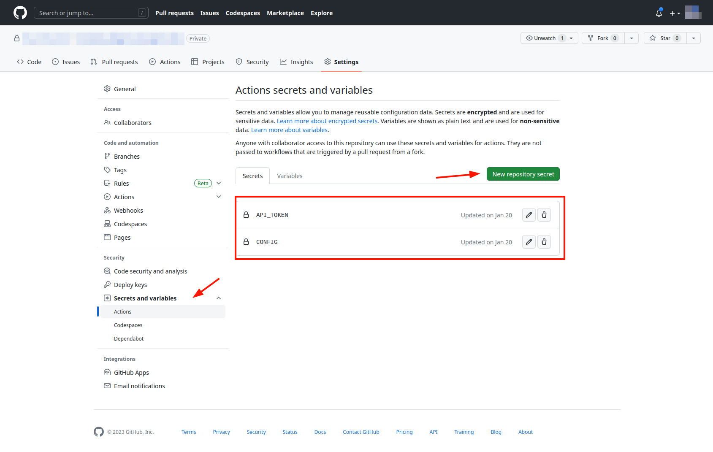
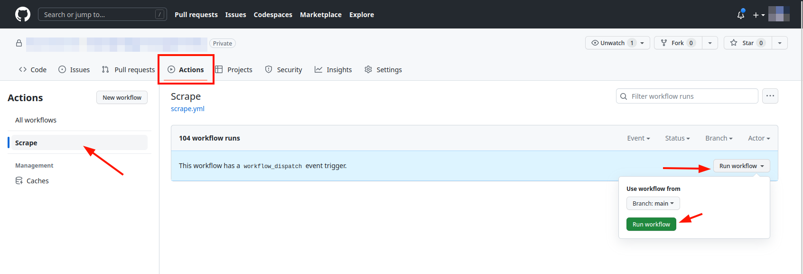

# Externally

## Summary
1. Create an import token
1. Set up a JSON file with your credentials
1. Run the import. *Either*:
    1. Fork [money-tiger-scraper](https://github.com/BackSlasher/money-tiger-scraper) on GitHub
    1. Run [money-tiger-scraper-docker](https://github.com/BackSlasher/money-tiger-scraper-docker)

## 1. Create an import token
1. Navigate to [🐯 Import Keys](https://www.money-tiger.tech/accounts/settings/import-keys)
2. Create a new key and copy the key


## 2. Set up a JSON file with your credentials
The scraper is using [israeli-bank-scrapers](https://github.com/eshaham/israeli-bank-scrapers/).
We'll need to compose the credentials according to company names and fields specified in the scraper [definition file](https://github.com/eshaham/israeli-bank-scrapers/blob/master/src/definitions.ts).

The resulting JSON should be an array of objects containing `company` (string) and `credentials` (object according to the definition),  
Example file:
```json
[
{"company":"hapoalim", "credentials":{"userCode": "123456", "password": "VerySecret"}},
{"company":"amex","credentials":{ "id": "7890", "card6Digits":"234567", "password": "SecretStuff"}}
]
```
Same file, in a prettier display:
```json
[
  {
    "company": "hapoalim",
    "credentials": {
      "userCode": "123456",
      "password": "VerySecret"
    }
  },
  {
    "company": "amex",
    "credentials": {
      "id": "7890",
      "card6Digits": "234567",
      "password": "SecretStuff"
    }
  }
]

```

## 3.a. Fork [money-tiger-scraper](https://github.com/BackSlasher/money-tiger-scraper) on GitHub

1. Open the repo and click "fork". Choose a private repository.
1. Go to the forked repository's settings, and there to "Secrets and Variables > Actions"
1. Create two new secrets:
    
    1. `API_TOKEN`, place the value from section #1
    1. `CONFIG`, place the JSON from section #2
    
1. Navigate to the "actions" tab. Choose the "Scrape" action.
    1. Click on "Run Workflow", and then "Run Workflow". Keep the main branch selected.
    
    2. Wait for the job to complete. It should be green.
    

You should now have transactions present in the [🐯 Transactions page](https://www.money-tiger.tech/txns/transactions/).  
The task will run daily and collect new transactions.

## 3.b. Run [money-tiger-scraper-docker](https://github.com/BackSlasher/money-tiger-scraper-docker)

Instead of running the scraper in GitHub actions, you can run it locally.  
It's a NodeJS application using the Puppeteer framework.

1. Fork the repository, e.g.

        git clone https://github.com/BackSlasher/money-tiger-scraper-docker

1. Install requirements

        npm ci

1. Prepare the import token and JSON config as environment variables.  
    `CONFIG` can either be the JSON itself, or a path to the JSON file.


        export API_TOKEN=fk5p4P3m3nqM5nOk3tXpBMnLnch9jqp7KzXwlVOF
        export CONFIG=config.json

1. Optionally, set `SHOW_BROWSER` as well to see the scraping in action

        export SHOW_BROWSER=1

1. Run the scraper

        node src/index.js

You should now have transactions present in the [🐯 Transactions page](https://www.money-tiger.tech/txns/transactions/).  
You'll probably want to run this periodically to collect new transactions. Consider using cron.
