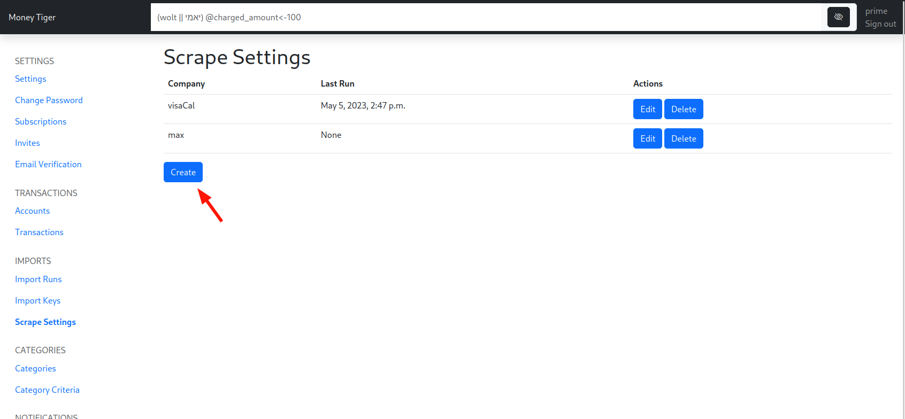
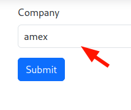
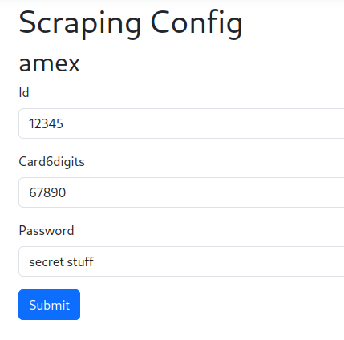
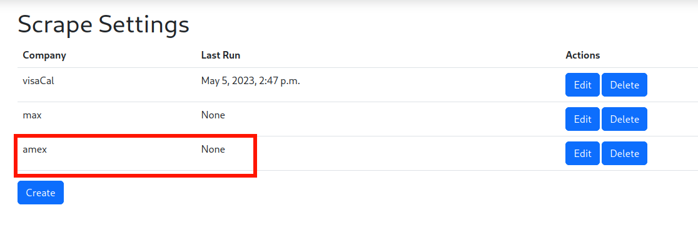

# Internally

1. Go to [🐯  Scrape Settings ](https://www.money-tiger.tech/imports/scrape_settings)
2. For every user in a bank / credit card comapny, create a new config  
    
3. Choose the correct bank / credit card company  
    
4. Specify the required credentials. Make sure they are correct!  
    
5. Click submit. First attempt will happen soon, and every 24 hours from then on.  
    
