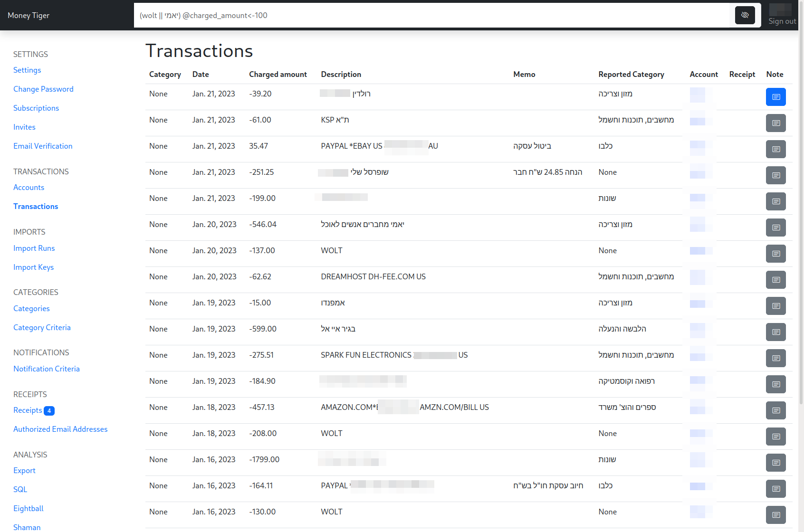

# Transactions

Transactions are the main functionality of the site.
Each transaction represents a "line" in your credit card bill, or your bank account history page.

You can view them using the [🐯 Transactions page](https://www.money-tiger.tech/txns/transactions/)

See [Collecting](collecting.md) for how to gather them.
At the moment, some assembly is required

## Removing
There is no way to remove transactions at the moment.
Let me know if this is a feature you'd like to have.

## Editing
You cannot edit a transaction. We consider them immutable. Instead, you can add some metadata to it, like a category, receipt or note.
